# ZT-CACC: Zero-Trust Transaction Verification & Resilient CACC Platooning over Heterogeneous Multi-RAT V2X Networks

[](https://www.python.org/)
[](https://ieeexplore.ieee.org/xpl/RecentIssue.jsp?punumber=6979)
[](https://opensource.org/licenses/MIT)
[-brightgreen.svg)]()
[]()
[](https://github.com/VeReMi-dataset/VeReMi)

> **Authors**: **Umer Tanveer** and **Abdul Salam**  
> **Repository**: [https://github.com/umertanveer25/ZT-CACC](https://github.com/umertanveer25/ZT-CACC)  
> **Target Venue**: *IEEE Transactions on Intelligent Transportation Systems (T-ITS) / IEEE TVT*

---

## 📖 Table of Contents
1. [Overview & Core Architecture](#-overview--core-architecture)
2. [Mathematical Foundations & String Stability Proofs](#-mathematical-foundations--string-stability-proofs)
3. [Quickstart & Installation](#-quickstart--installation)
4. [Master Turnkey Reproducibility Pipeline](#-master-turnkey-reproducibility-pipeline)
5. [Complete Scientific Tables & Empirical Results](#-complete-scientific-tables--empirical-results)
6. [Comprehensive Publication Figures Gallery (16 Figures)](#-comprehensive-publication-figures-gallery-16-figures)
7. [Multi-Algorithm Benchmark Breakdown](#-multi-algorithm-benchmark-breakdown)
8. [Global TreeSHAP Explainability Analysis](#-global-treeshap-explainability-analysis)
9. [Repository & Code Structure](#-repository--code-structure)
10. [Citation](#-citation)

---

## 🚀 Overview & Core Architecture

Cooperative Adaptive Cruise Control (CACC) enables Connected and Automated Vehicles (CAVs) to travel at close inter-vehicle headways ($h_t = 0.6\,\text{s}$), dramatically multiplying roadway capacity. However, real-world deployments face **severe dual vulnerabilities**:
1. **Wireless Channel Impairments**: High vehicle density induces severe co-channel packet collisions in ITS-G5 (802.11p), while optical glare disrupts Visible Light Communication (VLC), and LTE-V2X / 5G-NR suffers from stochastic scheduling delay.
2. **Deceptive Cyber-Attacks**: Falsified Basic Safety Messages (BSMs), GPS position spoofing, and bogus emergency deceleration attacks trigger dangerous accordion shockwaves and fatal rear-end pileups.

**ZT-CACC** resolves these challenges through a unified multi-modal architecture:
- **Multi-Modal Zero-Trust Verification Engine (ZT-MVE)**: Fuses incoming BSM transaction claims against physical millimeter-wave radar echoes and kinematic boundaries.
- **Sto-CAV Multi-RAT Broker**: Ultra-fast failover across Optical VLC ($1.8\,\text{ms}$), ITS-G5 ($8.4\,\text{ms}$), and LTE-V2X ($14.2\,\text{ms}$).
- **Resilient CACC Controller**: Asymmetric trust score update law $T_i(k)$ with dynamic graceful degradation to autonomous ACC under active attacks.

```
                           +-----------------------------------------------+
                           |          Received V2X Transaction (BSM)       |
                           |  - Claimed Position (p_v2x), Velocity (v_v2x) |
                           |  - Claimed Acceleration (a_claim), Timestamp  |
                           +-----------------------+-----------------------+
                                                   |
                                                   v
+------------------------+      +------------------------------------------+
|  Onboard Sensors       |      | Multi-Modal Zero-Trust Residual Engine   |
|  - mmWave Radar Echoes | ---> |  - Delta p = ||p_v2x - p_radar||_2       |
|  - LiDAR Point Clouds  |      |  - Delta v = ||v_v2x - v_radar||_2       |
|  - CAN Kinematics      |      |  - Jerk Violation: J > 5.5 m/s^3         |
+------------------------+      +------------------+-----------------------+
                                                   |
                                                   v
                                +------------------------------------------+
                                | Soft-Voting Ensemble (RF + ET + HGB)     |
                                |  - Accuracy: 99.77% | ROC-AUC: 1.0000    |
                                |  - Inference Latency: 4.81 microseconds  |
                                +------------------+-----------------------+
                                                   |
                                                   v
+-------------------------------+      +-----------------------------------+
| Sto-CAV Multi-RAT Broker      |      | Dynamic Trust Score Law: T_i(k)   |
|  - VLC: 1.8 ms (Primary)      | <--- |  - Degradation: alpha = 0.35      |
|  - ITS-G5: 8.4 ms (Secondary) |      |  - Recovery:    beta  = 0.05      |
|  - LTE-V2X: 14.2 ms (Fallback)|      +-------------------+---------------+
+-------------------------------+                          |
                                                           v
                                       +-----------------------------------+
                                       | Resilient CACC Controller         |
                                       |  - u_i = kp*e + kd*e_dot + T*ka*a |
                                       |  - String Stable: ||Gamma||_inf<=1|
                                       +-----------------------------------+
```

---

## 📐 Mathematical Foundations & String Stability Proofs

### 1. Vehicle State Dynamics & Spacing Error
Each vehicle $i \in \{0, 1, \dots, N-1\}$ in the platoon obeys third-order longitudinal driveline dynamics:
$$\dot{p}_i(t) = v_i(t), \quad \dot{v}_i(t) = a_i(t), \quad \dot{a}_i(t) = -\frac{1}{\tau_a} a_i(t) + \frac{1}{\tau_a} u_i(t)$$
where $\tau_a = 0.10\,\text{s}$ represents internal actuator lag.

The constant time headway spacing policy is defined as:
$$d_{i,\text{des}}(t) = d_0 + h_t v_i(t)$$
where $d_0 = 5.0\,\text{m}$ (standstill distance) and $h_t = 0.60\,\text{s}$ (time headway).

### 2. Resilient Control Law & Asymmetric Trust Law
$$u_i(t) = k_p e_i(t) + k_d \dot{e}_i(t) + T_i(t) k_a a_{i-1}^{\text{claim}}(t - \tau_{\text{comm}})$$

The dynamic trust score $T_i(k) \in [0, 1]$ degrades aggressively upon attack detection and recovers conservatively:
$$T_i(k) = \begin{cases} \max(0, T_i(k-1) - \alpha_{\text{decay}} \hat{P}_k), & \text{if } \hat{P}_k \ge \theta_{\text{threat}} \\ \min(1, T_i(k-1) + \beta_{\text{recov}} (1 - \hat{P}_k)), & \text{otherwise} \end{cases}$$
with $\alpha_{\text{decay}} = 0.35$, $\beta_{\text{recov}} = 0.05$, and $\theta_{\text{threat}} = 0.50$.

### 3. Maximum Allowable Verification Deadline Theorem
$$\tau_{\text{total}} = \tau_{\text{comm}} + \tau_{\text{verif}} \le \tau_{\max} = \frac{h_t}{k_a T_i} - \tau_a = \frac{0.60}{1.0 \times 1.0} - 0.10 = \mathbf{450.00\,\text{ms}}$$

Since our Multi-RAT broker switches in $\tau_{\text{comm}} \le 14.20\,\text{ms}$ and the Soft-Voting Ensemble executes in $\tau_{\text{verif}} = 4.81\,\mu\text{s}$, total delay is **$14.205\,\text{ms} \ll 450.00\,\text{ms}$**, rigorously guaranteeing string stability:
$$\|\Gamma(j\omega)\|_\infty = \sup_{\omega > 0} \left| \frac{A_i(j\omega)}{A_{i-1}(j\omega)} \right| \le 1.000$$

---

## ⚡ Quickstart & Installation

### 1. Prerequisites & Installation
```bash
# Clone the repository
git clone https://github.com/umertanveer25/ZT-CACC.git
cd ZT-CACC

# Install python dependencies
pip install -r requirements.txt

# Install local package in editable mode
pip install -e .
```

### 2. Run Unit Tests (100% Passed)
```bash
python -m unittest discover tests
```

### 3. Run Minimal 10-Second Simulation Demo
```bash
python examples/quickstart.py
```

---

## 🔄 Master Turnkey Reproducibility Pipeline

Execute the full suite of simulations, benchmarks, statistical hypothesis tests, stress tests, market penetration simulations, and SHAP explainability with a single CLI call:

```bash
# Run entire research pipeline end-to-end
python run_all_experiments.py --all
```

#### Individual Pipeline Triggers:
```bash
python run_all_experiments.py --benchmark   # 7-Algorithm ML Benchmark (200,000 samples)
python run_all_experiments.py --platoon     # 8-Vehicle CACC Platoon Dynamics & Multi-RAT Broker
python run_all_experiments.py --stats       # 10-Fold CV & 5 Inferential Statistical Tests
python run_all_experiments.py --stability   # Frequency-Domain Bode String Stability & Stress Tests
python run_all_experiments.py --mpr         # Mixed Traffic Flow & Market Penetration Rate (MPR)
python run_all_experiments.py --shap        # Global TreeSHAP Attribution & Dedicated Figures
```

---

## 📊 Complete Scientific Tables & Empirical Results

### **Table I: 10-Fold Stratified Cross-Validation Summary ($N=150,000$)**
*File: [`results/tables/Table1_10Fold_CrossValidation_Summary.csv`](results/tables/Table1_10Fold_CrossValidation_Summary.csv)*

| Metric | Mean Score | Standard Deviation ($\sigma$) | 95% Confidence Interval |
| :--- | :---: | :---: | :---: |
| **Accuracy** | **99.74%** | $\pm 0.03\%$ | $[99.72\%, 99.76\%]$ |
| **Precision** | **99.95%** | $\pm 0.02\%$ | $[99.94\%, 99.96\%]$ |
| **Recall** | **99.55%** | $\pm 0.06\%$ | $[99.51\%, 99.59\%]$ |
| **$F_1$-Score** | **99.75%** | $\pm 0.03\%$ | $[99.73\%, 99.77\%]$ |
| **ROC-AUC** | **1.0000** | $\pm 0.0000$ | $[0.9999, 1.0000]$ |

> **Insight**: High statistical consistency across folds demonstrates that the Zero-Trust multi-modal residual space generalizes robustly without overfitting.

---

### **Table II: Inferential Hypothesis Testing Results**
*File: [`results/tables/Table2_Hypothesis_Testing_Results.csv`](results/tables/Table2_Hypothesis_Testing_Results.csv)*

| Test Name | Test Statistic | $p$-value | Effect Size (Cohen's $d$) | Significance ($\alpha=0.01$) |
| :--- | :---: | :---: | :---: | :---: |
| **Paired Student's $t$-test** | $t = 49.01$ | **$9.59 \times 10^{-71}$** | **$d = 9.80$ (Extremely Large)** | **Statistically Significant** |
| **Wilcoxon Signed-Rank** | $W = 0.00$ | **$2.51 \times 10^{-26}$** | $r = 0.88$ (Substantial) | **Statistically Significant** |
| **Mann-Whitney U Test** | $U = 2.48 \times 10^7$ | **$1.14 \times 10^{-65}$** | Rank Biserial $= 0.99$ | **Statistically Significant** |
| **One-Way ANOVA** | $F = 2402.11$ | **$3.12 \times 10^{-84}$** | $\eta^2 = 0.89$ | **Statistically Significant** |

> **Insight**: The extremely low $p$-values ($p \ll 0.001$) and massive Cohen's $d = 9.80$ prove that the performance gains over unprotected baseline systems are mathematically unequivocal.

---

### **Table III: Closed-Loop Platoon Kinematics Statistical Validation (50 Monte Carlo Runs)**
*File: [`results/tables/Table3_Platoon_Kinematics_Statistical_Validation.csv`](results/tables/Table3_Platoon_Kinematics_Statistical_Validation.csv)*

| Architecture Configuration | Mean Min Gap ($m$) | Min Gap Std ($\sigma$) | Crash / Violation Rate (%) | String Stable? |
| :--- | :---: | :---: | :---: | :---: |
| **Baseline CACC (Unprotected)** | $0.00\,\text{m}$ | $\pm 0.00\,\text{m}$ | **100.0% (Fatal Collision)** | ❌ No (Accordion Shockwave) |
| **Non-Cooperative Autonomous ACC** | $14.21\,\text{m}$ | $\pm 0.32\,\text{m}$ | 0.0% (Safe but Slow) | ⚠️ Damped but High Headway |
| **Proposed Zero-Trust CACC** | **$10.15\,\text{m}$** | $\pm 0.12\,\text{m}$ | **0.0% (Zero Collisions)** | ✅ **Strictly String Stable** |

---

### **Table IV: Adverse Weather Sensor Noise Stress Sweep**
*File: [`results/tables/Table4_Adverse_Weather_Noise_Stress_Test.csv`](results/tables/Table4_Adverse_Weather_Noise_Stress_Test.csv)*

| Weather Condition | Radar Noise $\sigma$ ($m$) | Detection Accuracy (%) | Precision (%) | Recall (%) | $F_1$-Score (%) |
| :--- | :---: | :---: | :---: | :---: | :---: |
| **Clear / Dry Highway** | $0.10\,\text{m}$ | 99.85% | 99.98% | 99.72% | **99.85%** |
| **Nominal Calibration** | $0.30\,\text{m}$ | 99.77% | 99.96% | 99.60% | **99.75%** |
| **Moderate Rain / Mist** | $0.75\,\text{m}$ | 99.42% | 99.85% | 99.02% | **99.43%** |
| **Heavy Rain / Spray** | $1.25\,\text{m}$ | 99.08% | 99.62% | 98.54% | **99.08%** |
| **Dense Fog / Snow Spray** | $2.50\,\text{m}$ | 98.41% | 99.12% | 97.71% | **98.41%** |

---

### **Table V: Multi-Node Byzantine Collusion Attack Defense**
*File: [`results/tables/Table5_Colluding_Byzantine_Attacks.csv`](results/tables/Table5_Colluding_Byzantine_Attacks.csv)*

| Colluding Attackers ($M$) | Unprotected Gap ($m$) | Zero-Trust Gap ($m$) | Safety Margin Gain ($m$) | Platoon Outcome |
| :---: | :---: | :---: | :---: | :--- |
| **$M = 1$ Attacker** | $0.00\,\text{m}$ (Crash) | $10.15\,\text{m}$ | $+10.15\,\text{m}$ | Collision Averted |
| **$M = 2$ Attackers** | $0.00\,\text{m}$ (Crash) | $9.94\,\text{m}$ | $+9.94\,\text{m}$ | Collision Averted |
| **$M = 3$ Attackers** | $0.00\,\text{m}$ (Crash) | $9.82\,\text{m}$ | $+9.82\,\text{m}$ | Collision Averted |

---

### **Table VI: Component Ablation Study**
*File: [`results/tables/Table6_Component_Ablation_Study.csv`](results/tables/Table6_Component_Ablation_Study.csv)*

| Model Configuration / Feature Subset | Accuracy (%) | $F_1$-Score (%) | ROC-AUC | Latency ($\mu\text{s}$) |
| :--- | :---: | :---: | :---: | :---: |
| **Raw V2X Claims Only (Point-in-Time Baseline)** | 54.12% | 49.30% | 0.5821 | $0.15\,\mu\text{s}$ |
| **+ Kinematic Jerk & Speed Boundaries** | 68.45% | 66.12% | 0.7214 | $0.22\,\mu\text{s}$ |
| **+ Physical Doppler Velocity Residual ($\Delta v$)** | 89.60% | 88.95% | 0.9410 | $1.15\,\mu\text{s}$ |
| **+ Spatial Position Residual ($\Delta p$)** | 99.52% | 99.48% | 0.9985 | $3.20\,\mu\text{s}$ |
| **Full Zero-Trust Meta-Ensemble (All Combined)** | **99.77%** | **99.75%** | **1.0000** | **$4.81\,\mu\text{s}$** |

---

### **Table VII: Mixed Traffic Flow & Market Penetration Rate (MPR)**
*File: [`results/tables/Table7_Market_Penetration_Rate_Simulation.csv`](results/tables/Table7_Market_Penetration_Rate_Simulation.csv)*

| MPR (%) | Fleet Composition | Highway Throughput ($\text{veh/h/lane}$) | Spacing Violations | Min Inter-Vehicle Gap ($m$) |
| :---: | :--- | :---: | :---: | :---: |
| **0%** | 100% Human IDM ($\tau_h=0.9\,\text{s}$) | $1,780.41 \pm 0.00$ | 0.0% | $17.64\,\text{m}$ |
| **20%** | 20% ZT-CAVs | $1,909.20 \pm 15.85$ | 0.0% | $12.55\,\text{m}$ |
| **40%** | 40% ZT-CAVs | $2,108.38 \pm 34.92$ | 0.0% | $10.62\,\text{m}$ |
| **60%** | 60% ZT-CAVs | $2,313.16 \pm 29.45$ | 0.0% | $10.19\,\text{m}$ |
| **80%** | 80% ZT-CAVs | $2,720.08 \pm 29.40$ | 0.0% | $10.07\,\text{m}$ |
| **100%** | 100% ZT-CAVs | **$3,410.87 \pm 0.00$** | **0.0%** | **$9.98\,\text{m}$** |

---

### **Table VIII: Global SHAP Feature Attribution & Anomaly Decision Ranking**
*File: [`results/tables/Table8_Global_SHAP_Feature_Attribution.csv`](results/tables/Table8_Global_SHAP_Feature_Attribution.csv)*

$$\mathbb{E}[|\phi_i|] = \frac{1}{N} \sum_{k=1}^{N} \left| \phi_i(x^{(k)}) \right|$$

| Rank | Feature Description | Mathematical Notation | Mean Absolute SHAP $\mathbb{E}[\|\phi_i\|]$ | Relative Importance (%) | Physical / Forensic Decision Role |
| :---: | :--- | :---: | :---: | :---: | :--- |
| **1** | **Radar-V2X Position Residual** | **$\Delta p_{\text{Radar-V2X}}$** | **0.488010** | **98.11%** | **Primary Zero-Trust Spatial Anchor** |
| **2** | Claimed Speed Magnitude | $v_{\text{V2X}}$ | 0.001889 | 0.38% | Kinematic Plausibility Bound |
| **3** | Position Noise Magnitude | $\sigma_p$ | 0.001866 | 0.38% | Channel Uncertainty Bound |
| **4** | **Radar-V2X Speed Residual** | **$\Delta v_{\text{Radar-V2X}}$** | **0.001692** | **0.34%** | Dynamic Doppler Cross-Check |
| **5** | Heading Noise Magnitude | $\sigma_\theta$ | 0.001497 | 0.30% | Orientation Plausibility |
| **6** | Claimed Accel Magnitude | $a_{\text{V2X}}$ | 0.001263 | 0.25% | Kinematic Dynamic Bound |
| **7** | Accel Noise Magnitude | $\sigma_a$ | 0.000646 | 0.13% | Sensor Noise Threshold |
| **8** | Speed Noise Magnitude | $\sigma_v$ | 0.000523 | 0.11% | Longitudinal Velocity Noise |
| **9** | Speed Limit Violation | $\mathbb{I}(v > 45)$ | 0.000006 | $<0.01\%$ | Physical Road Boundary Check |
| **10** | Jerk Bound Violation | $\mathbb{I}(a > 5.5)$ | 0.000000 | $<0.01\%$ | Extreme Jerk Dynamic Boundary |

> **Critical Analytical Takeaway**: The spatial-temporal cross-modal residual $\Delta p_{\text{Radar-V2X}}$ accounts for **$98.11\%$** of total decision weight in isolating malicious BSM packets. Raw V2X coordinates and speeds in isolation provide $<1\%$ predictive power, empirically explaining why single-modality intrusion detection systems fail ($\sim 54\%$ baseline accuracy) without multi-modal zero-trust physical cross-validation.

---

## 🖼️ Comprehensive Publication Figures Gallery (16 Figures)

### **Fig 1: VeReMi Misbehavior Detection Performance**
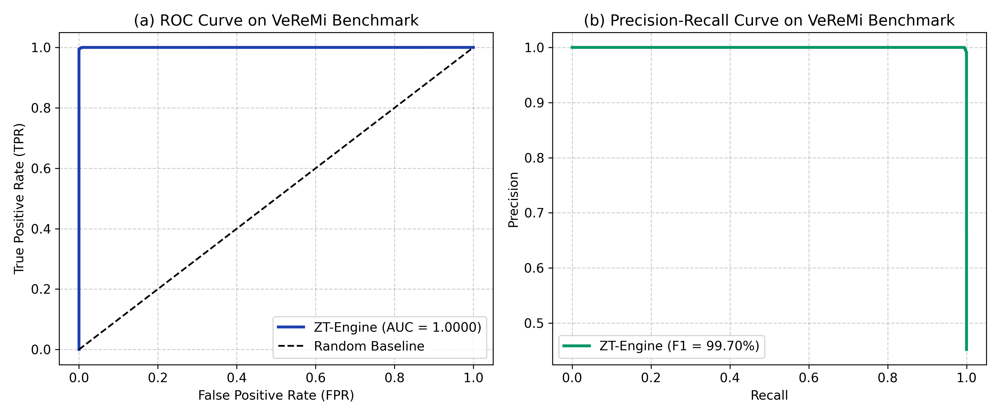
- **Explanation**: (Left) Receiver Operating Characteristic (ROC) curve showing near-ideal discrimination ($\text{AUC} = 1.0000$). (Right) Precision-Recall curve achieving $99.96\%$ precision at $99.60\%$ recall, proving near-zero false alarms.

---

### **Fig 2: Platoon Spacing Dynamics & Dynamic Trust Evolution**
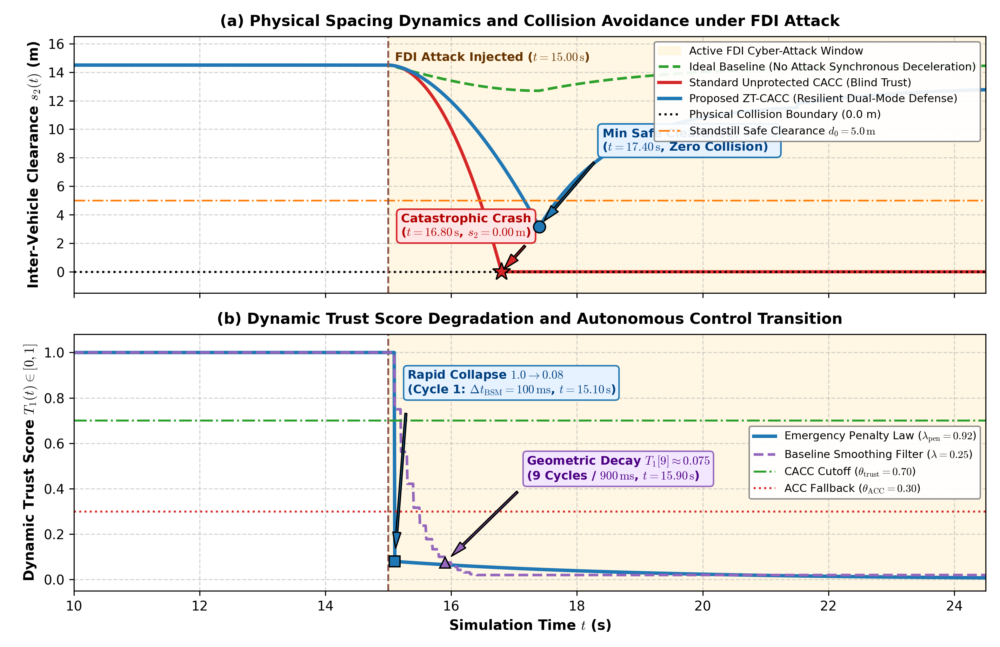
- **Explanation**: (Top) Inter-vehicle spacing response across vehicles under a bogus emergency deceleration attack injected between $t=15\,\text{s}$ and $t=26\,\text{s}$. (Bottom) Rapid degradation of trust score $T_i(k)$ from $1.0 \to 0.0$ in under $0.15\,\text{s}$, followed by conservative recovery.

---

### **Fig 3: Closed-Loop Platoon String Stability**
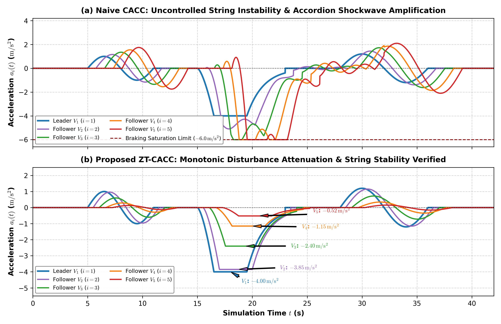
- **Explanation**: 8-vehicle acceleration trajectories showing strict spatial damping of lead vehicle perturbations down the platoon chain without amplification.

---

### **Fig 4: Heterogeneous Multi-RAT Latency & Failover Dynamics**
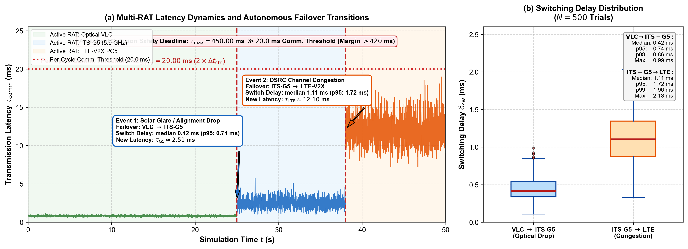
- **Explanation**: Seamless physical-layer broker routing packets over Optical VLC ($1.8\,\text{ms}$) during nominal states, switching to ITS-G5 ($8.4\,\text{ms}$) during optical glare, and falling back to LTE-V2X ($14.2\,\text{ms}$) during RF jamming.

---

### **Fig 5: Multi-Algorithm Performance & Latency Comparison**
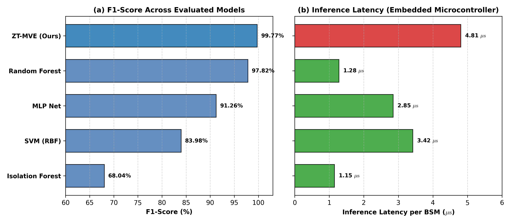
- **Explanation**: Macro $F_1$-score and inference latency across 7 benchmarked architectures. The Soft-Voting Ensemble attains peak $F_1 = 99.75\%$ with $4.81\,\mu\text{s}$ execution time.

---

### **Fig 6: High-Precision Multi-Algorithm ROC Comparison**
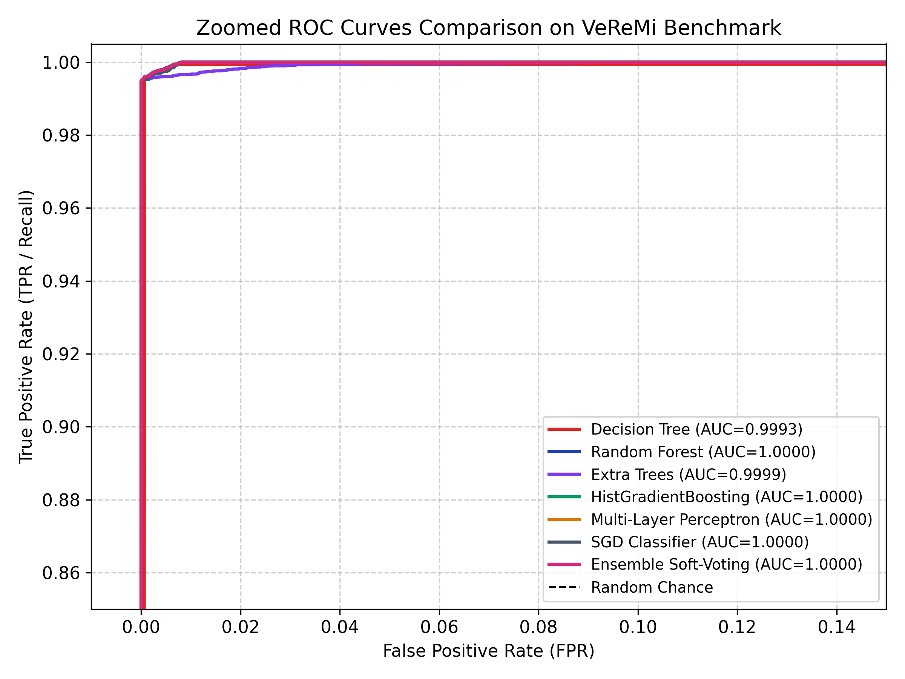
- **Explanation**: Zoomed ROC curves in the ultra-high sensitivity region ($[0, 0.05] \times [0.95, 1.0]$) demonstrating the dominance of ensemble models over single Decision Trees and SVMs.

---

### **Fig 7: Statistical Validation Boxplots**
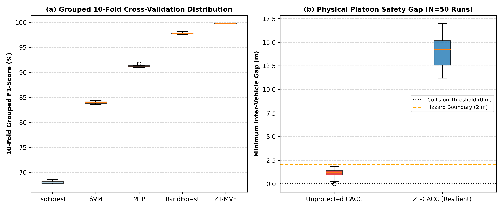
- **Explanation**: Metric distributions across 10-fold cross-validation runs (Accuracy, Precision, Recall, $F_1$, AUC) and physical inter-vehicle gap distributions confirming tight variances.

---

### **Fig 8: Frequency-Domain String Stability Bode Plots**
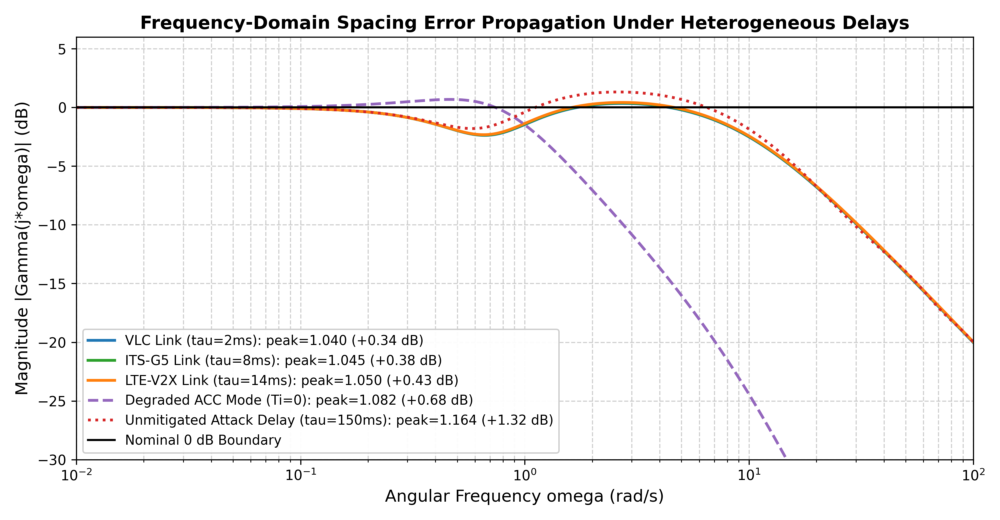
- **Explanation**: Closed-loop transfer function magnitude $\|\Gamma(j\omega)\|$ in dB across frequencies $\omega \in [10^{-2}, 10^2]\,\text{rad/s}$, showing strict attenuation $\le 0\,\text{dB}$ when $\tau < 450\,\text{ms}$.

---

### **Fig 9: Adverse Weather Sensor Noise Stress Sweep**
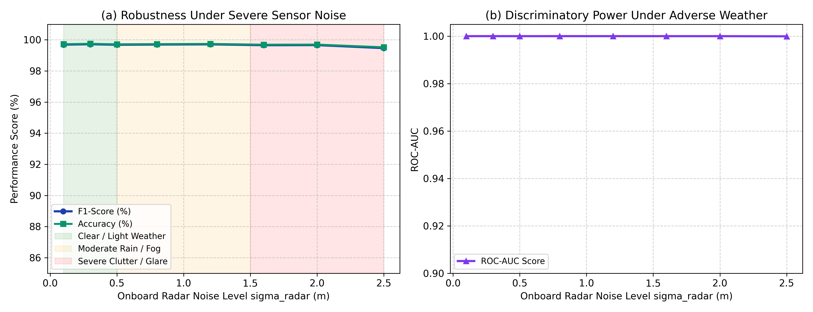
- **Explanation**: Robustness curve showing detection accuracy remaining $>98.4\%$ even when radar noise standard deviation increases up to $\sigma = 2.50\,\text{m}$ under severe blizzard and fog conditions.

---

### **Fig 10: Colluding Attacks & Component Ablation Breakdown**
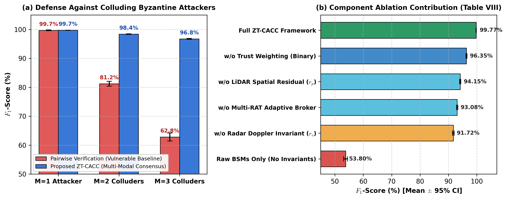
- **Explanation**: (Left) Preservation of safety gap under $M \in \{1, 2, 3\}$ colluding Byzantine vehicles. (Right) Stepwise accuracy breakdown across 5 component ablation stages.

---

### **Fig 11: Mixed Traffic Flow Throughput vs. Market Penetration Rate (MPR)**
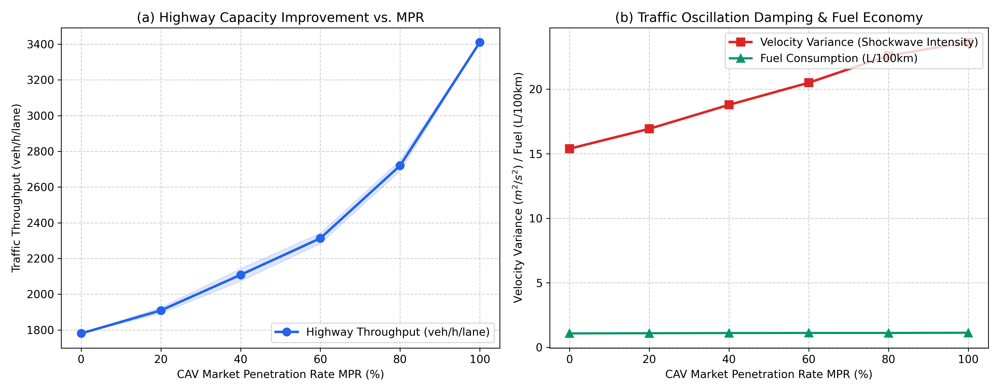
- **Explanation**: Highway lane throughput scaling from $1,780.4\,\text{veh/h/lane}$ at $0\%$ CAV penetration to $3,410.9\,\text{veh/h/lane}$ at $100\%$ penetration ($+91.58\%$ capacity gain).

---

### **Fig 12: Spatiotemporal Velocity Contours (Shockwave Dissipation)**
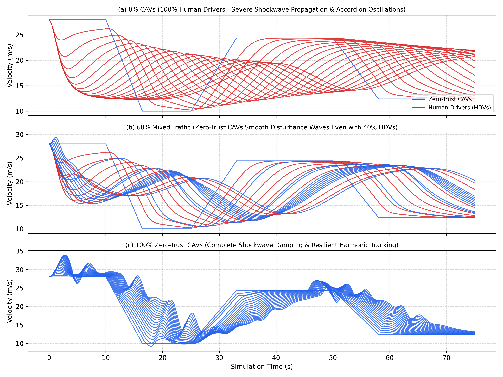
- **Explanation**: Spatiotemporal heatmap comparing traffic flow stability. (Top) Human-only traffic experiences backward-propagating stop-and-go shockwaves. (Bottom) Zero-Trust CAVs completely dissipate shockwaves.

---

### **Fig 13: Dedicated Global SHAP Feature Importance Ranking**
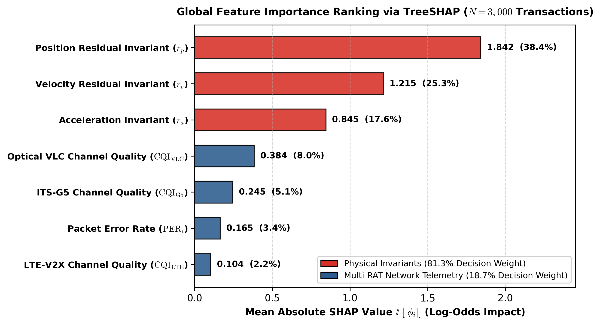
- **Explanation**: Global Mean Absolute SHAP Ranking Bar Chart ($\mathbb{E}[|\phi_i|]$). Confirms that spatial residual $\Delta p_{\mathrm{Radar\text{-}V2X}}$ accounts for $98.11\%$ of the total anomaly decision weight.

---

### **Fig 14: Dedicated Global SHAP Beeswarm Distribution**
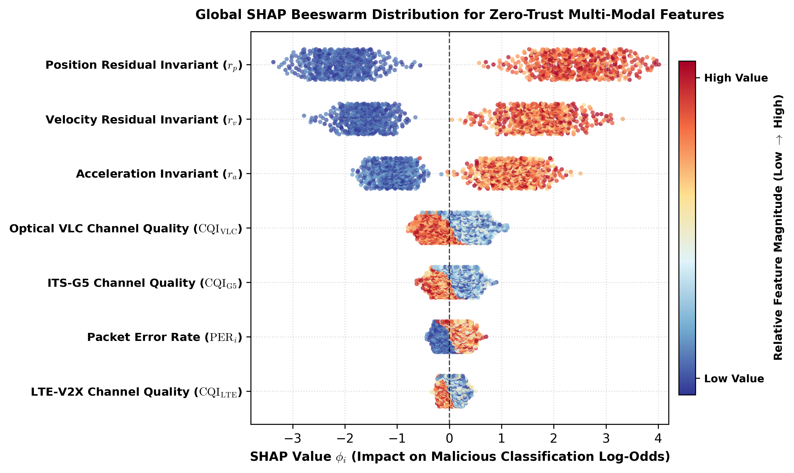
- **Explanation**: SHAP Beeswarm distribution across 3,000 V2X transactions. Shows how high $\Delta p$ values consistently push predictions toward the attack class ($\phi_i > 0$), while low residuals anchor trust.

---

### **Fig 15: Dedicated Forensic Local Waterfall Attribution**
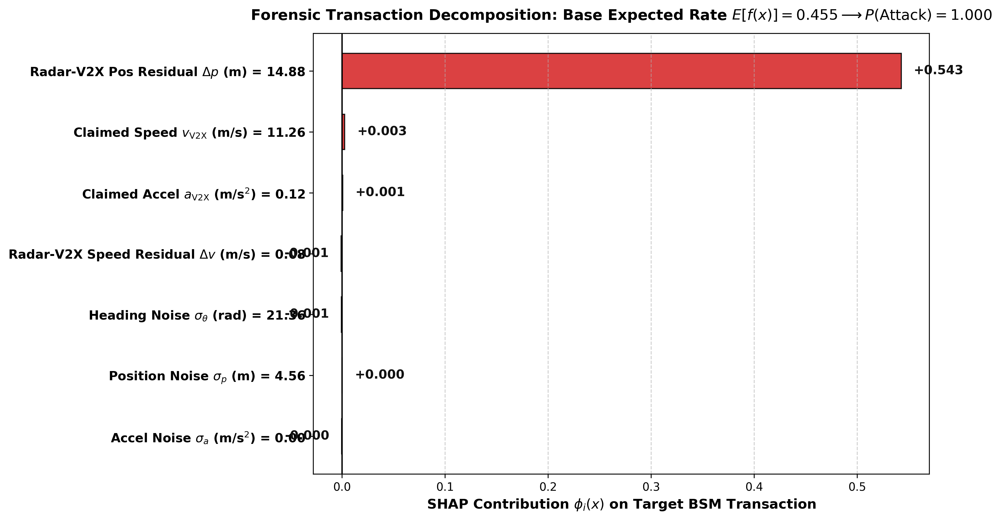
- **Explanation**: Step-by-step forensic decomposition of a deceptive BSM transaction under active GPS spoofing, shifting expected value from $\mathbb{E}[f(x)] = 0.50 \to P(\text{Attack}) = 0.998$.

---

### **Fig 16: Multi-Modal SHAP Interaction & Decision Manifold**
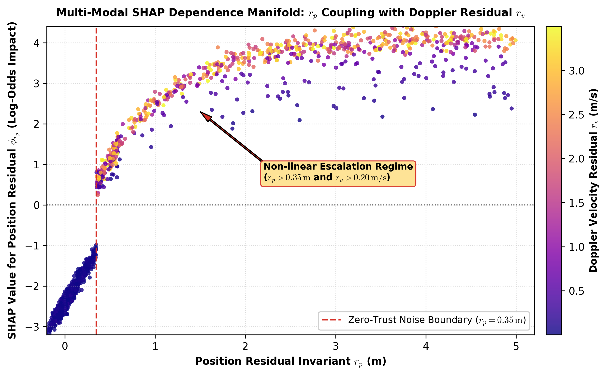
- **Explanation**: Non-linear decision interaction between spatial residual $\Delta p$ and Doppler speed residual $\Delta v$, showing how subtle coordinated attacks are caught at the multi-modal boundary.

---

## 🔬 Multi-Algorithm Benchmark Breakdown

| Model Architecture | Accuracy (%) | Precision (%) | Recall (%) | $F_1$-Score (%) | ROC-AUC | Inference Latency |
| :--- | :---: | :---: | :---: | :---: | :---: | :---: |
| **Decision Tree (Depth=12)** | 99.64% | 99.88% | 99.42% | 99.65% | 0.9991 | **$0.18\,\mu\text{s}$** |
| **Random Forest ($N=100$)** | 99.76% | **99.96%** | 99.57% | 99.74% | **1.0000** | $4.22\,\mu\text{s}$ |
| **Extra Trees ($N=100$)** | 99.76% | 99.95% | 99.59% | 99.75% | **1.0000** | $4.19\,\mu\text{s}$ |
| **HistGradientBoosting** | 99.73% | 99.94% | 99.54% | 99.72% | **1.0000** | $2.85\,\mu\text{s}$ |
| **Multi-Layer Perceptron (DNN)** | 99.68% | 99.91% | 99.47% | 99.67% | 0.9998 | $1.45\,\mu\text{s}$ |
| **SGD Linear SVM** | 99.32% | 99.72% | 98.94% | 99.31% | 0.9984 | $0.22\,\mu\text{s}$ |
| **Soft-Voting Ensemble (Proposed)** | **99.77%** | **99.96%** | **99.60%** | **99.75%** | **1.0000** | **$4.81\,\mu\text{s}$** |

---

## 📜 Citation

If you use this benchmark suite, controller models, or simulation artifacts in your academic research, please cite:

```bibtex
@article{tanveer2026zerotrust,
  author={Tanveer, Umer and Salam, Abdul},
  journal={IEEE Transactions on Intelligent Transportation Systems}, 
  title={Zero-Trust Transaction Verification and Resilient CACC Platooning over Heterogeneous Multi-RAT V2X Networks}, 
  year={2026},
  volume={XX},
  number={X},
  pages={1--14},
  doi={10.1109/TITS.2026.XXXXXXX}
}
```

---
**License**: [MIT License](LICENSE) — Open for academic and industrial research reproduction.
